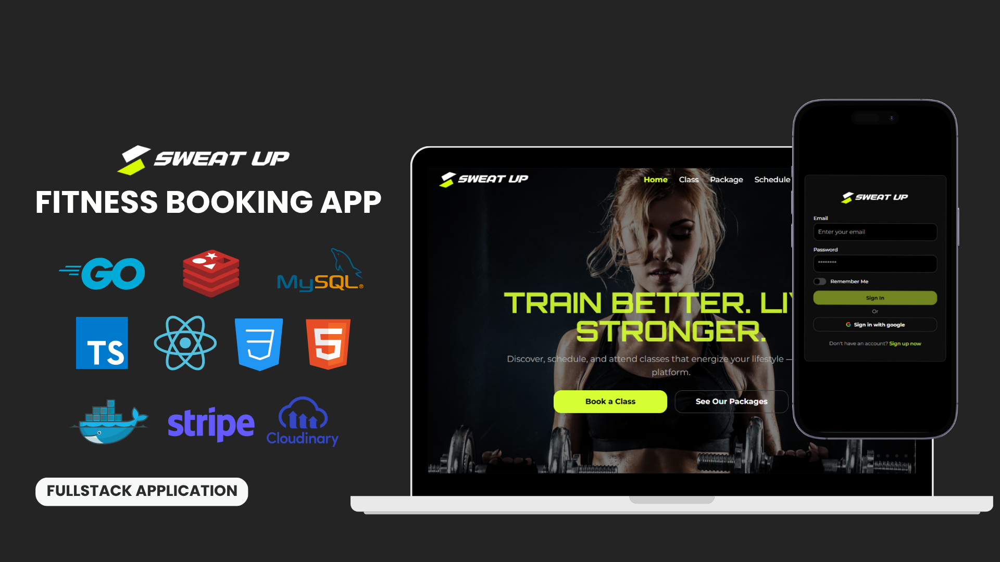
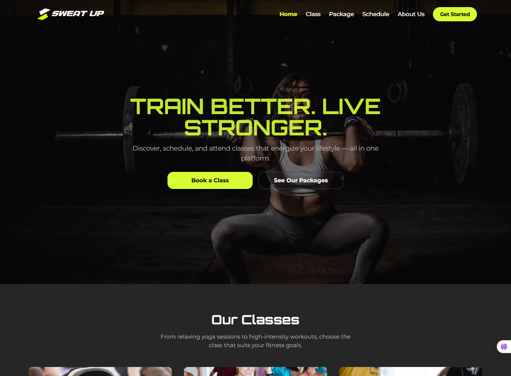
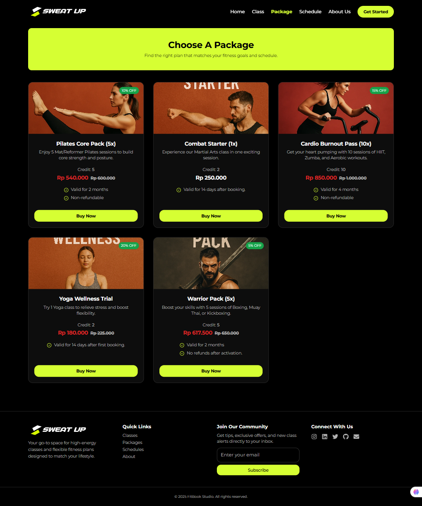
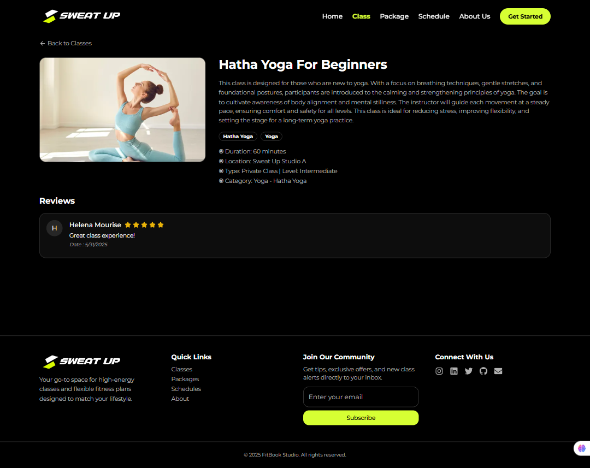
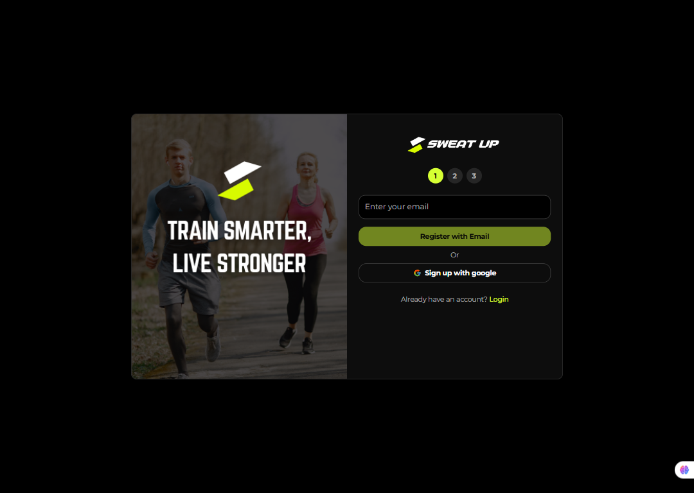
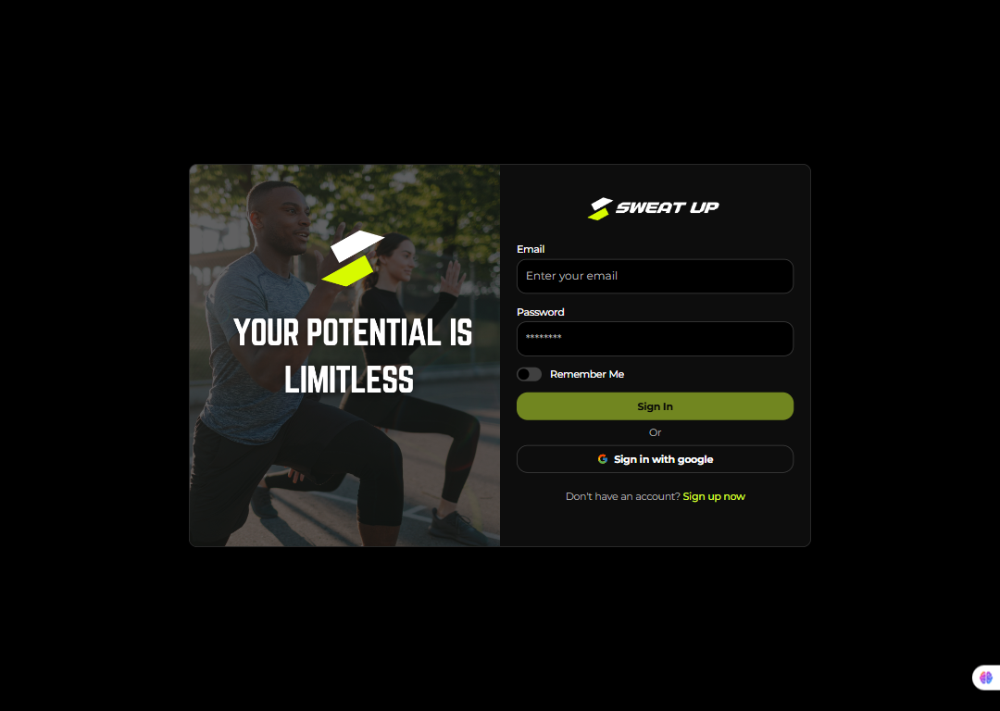
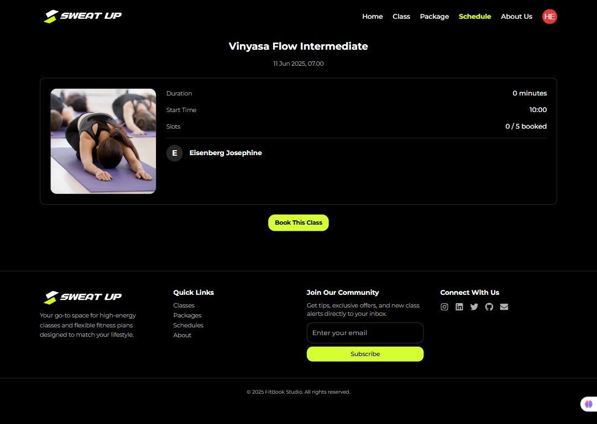
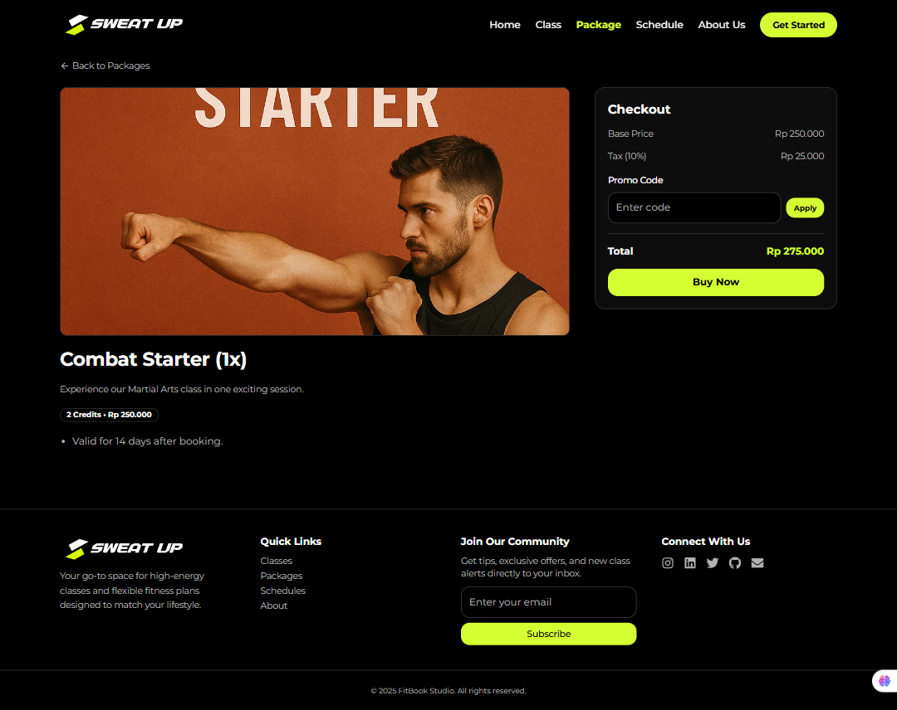

# 🏋️ SweatUp – Fitness Booking App

SweatUp is a fullstack fitness class booking application built to streamline the experience of finding, booking, and managing fitness classes. Designed for customers, instructors, and administrators, SweatUp allows users to explore available classes, purchase membership packages, book schedules, check in to sessions, and submit class reviews — all from an intuitive web interface.

The platform supports role-based access, automated class scheduling, real-time notifications, and secure online payments. With a powerful admin dashboard, administrators can manage instructors, class schedules, user bookings, and monitor activity across the system efficiently. SweatUp aims to bring convenience, structure, and scalability to fitness businesses through modern web technology.

---

## 1. Project Overview

SweatUp was developed to digitize and streamline the fitness class booking process for both customers and administrators. Traditional manual booking processes and third-party scheduling tools were inefficient, lacked flexibility for recurring schedules, and offered limited control over class attendance and instructor assignments. SweatUp was designed as an in-house, scalable alternative to unify all these features into one cohesive platform.

The platform became a key internal system for managing memberships, schedules, bookings, and attendance — reducing operational friction while improving user engagement and automation capabilities.

## 2. Project Requirements

- Enable customers to browse and book fitness classes based on time, instructor, and location
- Support one-time and recurring class scheduling with automated generation
- Implement role-based dashboards (customer, instructor, admin)
- Handle class check-ins and attendance with QR code validation
- Integrate payments via Stripe or Midtrans
- Send real-time and scheduled reminders via email or in-app notification

## 3. The Challenge

The main challenge in developing SweatUp was designing a scheduling system flexible enough to accommodate recurring and non-recurring classes, its tricky to manage a schedule to prevent conflict between instructor at the same schedule, while supporting real-time booking availability, instructor assignments, and attendance tracking. The application also needed to handle role-based access, reminders, and multiple payment scenarios — all within a user-friendly interface for both customers and admins.

## 4. The Approach & Solution

To address this, I built a fullstack web application using Go (Gin) for the backend and React for the frontend. The system featured a dynamic schedule engine that supported recurring class templates and one-time sessions, with conflict detection and automatic schedule generation via cron jobs. Users could purchase membership packages, book classes, check-in and check-out using codes. Instructors had tools to manage attendance and class updates, while admins could monitor system activity through a dashboard. Payment was integrated using Stripe and notifications were delivered via email and in-app alerts.

## 5. Key Features

- JWT + OAuth Authentication – Combines traditional login with Google OAuth integration

- Automatic Caching System using TanStack React Query for optimal performance

- Interactive Calendar Board for class management and scheduling

- Scheduled & Recurring Class Generation powered by automated cron jobs

- Class Booking Based on User Package Quotas

- Attendance System using code for checkout

- Review & Rating System for evaluating class and instructor quality

- Frontend Google OAuth Login for seamless authentication

- Automated Database Backup via scheduled cron jobs

- Role-Based Access Control (Admin, Customer, Owner) for secure access and management

- Admin Dashboard with real-time performance monitoring, user statistics, and revenue tracking

## 6. Tech Stack

### 6.1 Frontend

- **React 18** with **React Router v7**
- **TailwindCSS** + **Radix UI** + **ShadCN UI**
- **React Hook Form + Zod** (validasi form)
- **Zustand** (state management)
- **TanStack React Query** (data fetching and caching)
- **Framer Motion**
- **Google OAuth** via `@react-oauth/google`
- **Vite** (build tool)

### 6.2 Backend

- **Golang** (Gin Framework)
- **GORM** (ORM for MySQL)
- **MySQL** (Main database)
- **Redis** (Caching & token store)
- **Stripe** (Payment gateway)
- **RabbitMQ** (Event-driven notification)
- **JWT Auth** (Access & Refresh Token)

### 6.3 Deployment

- **VPS Hosting**
- **github Action** for CI / CD
- **Docker + Docker Compose**
- **Nginx** for Reverse proxy

---

## 7. Project Structure

### 7.1 Frontend

```
src/
├── assets/                         # Static files such as images, icons, and fonts
├── components/                     # Reusable global UI components
├── pages/                          # Page-level modules organized by main features
│   ├── auth/                       # Authentication pages (Login, Register)
│   ├── public/                     # Public pages (Home, About, Class/Package Details)
│   ├── admin/                      # Admin-specific pages and dashboards
├── hooks/                          # Global custom React hooks
│   ├── useScrollToTop.js
│   └── useModal.js
├── lib/                            # Utility functions and configuration files
│   ├── axios.js                    # Axios instance with baseURL and interceptors
│   ├── utils.js                    # General utility functions
│   ├── constant.js                 # Constants used across the app
│   └── schema.js                   # Zod schemas or validation rules
├── middleware/                     # Client-side route guards (e.g., protected routes)
│   └── protected_route.jsx
├── service/                        # API service modules to interact with the backend
│   └── auth.js
│   └── product.js
├── store/                          # Global state management (e.g., Zustand stores)
│   └── useAuthStore.ts
├── App.jsx                         # Root component defining app layout and routes
├── main.jsx                        # Entry point for rendering the React app
├── vite-env.d.js                   # Vite environment types and setup
└── index.html                      # HTML template used by Vite

```

### 7.2 Backend

```
server/
├── cmd/                     # Main entry point of the application
│   └── main.go              # The main file that runs the server
├── internal/
│   ├── config/              # Initialization of DB, Redis, Stripe, Cloudinary, etc.
│   ├── handlers/            # HTTP handlers for each feature (Controller layer)
│   ├── services/            # Core business logic of the application
│   ├── repositories/        # Direct access to the database (Query layer)
│   ├── models/              # GORM model definitions
│   ├── routes/              # Route grouping initialization per feature
│   ├── seeders/             # Seeders for initial system data
│   └── dto/                 # Data Transfer Objects for request/response handling
├── pkg/
│   ├── middleware/          # Reusable middleware (JWT, CORS, rate limiter)
│   ├── utils/               # Common utility functions (e.g., conversion, time, etc.)
│   ├── helper/              # Additional helpers (e.g., formatting, error handling)
├── tests/
│   ├── mocks/               # Mock data and objects for unit testing
│   ├── handlers/
│   ├── services/
│   ├── repositories/
├── go.mod                   # Go module dependency configuration
├── Dockerfile               # Docker build instructions
├── docker-compose.yml       # Multi-container setup for local development
├── deploy.sh                # Script for automated deployment
└── .env                     # Environment variables for local configuration

```

---

## 8. Authentication & Authorization

- OTP Login & Google OAuth – Supports both email-based OTP authentication and Google sign-in for flexible user onboarding
- X-API-KEY Validation – Secures selected endpoints with API key verification for external service access
- Refresh Token Mechanism – Automatically refreshes access tokens to maintain user sessions without requiring re-login
- Role-Based Middleware – Protects routes based on user roles (customer, admin, instructor) to ensure proper access control

---

## 9. API Features & Endpoints

### 9.1 Auth

| Method | Endpoint                  | Description              |
| ------ | ------------------------- | ------------------------ |
| POST   | /api/auth/login           | User login               |
| POST   | /api/auth/logout          | User logout              |
| POST   | /api/auth/register        | User registration        |
| POST   | /api/auth/send-otp        | Send OTP                 |
| POST   | /api/auth/verify-otp      | Verify OTP               |
| POST   | /api/auth/refresh-token   | Refresh access token     |
| GET    | /api/auth/google          | Google OAuth login       |
| GET    | /api/auth/google/callback | Google OAuth callback    |
| GET    | /api/auth/me              | Get current user profile |

### 9.2 Package

| Method | Endpoint                 | Description                |
| ------ | ------------------------ | -------------------------- |
| GET    | /api/packages            | Get all packages           |
| GET    | /api/packages/\:id       | Get package detail         |
| POST   | /api/admin/packages      | Create new package (admin) |
| PUT    | /api/admin/packages/\:id | Update package (admin)     |
| DELETE | /api/admin/packages/\:id | Delete package (admin)     |

### 9.3 Class

| Method | Endpoint                        | Description                  |
| ------ | ------------------------------- | ---------------------------- |
| GET    | /api/classes                    | Get all classes              |
| GET    | /api/classes/\:id               | Get class detail             |
| POST   | /api/admin/classes              | Create new class (admin)     |
| PUT    | /api/admin/classes/\:id         | Update class (admin)         |
| DELETE | /api/admin/classes/\:id         | Delete class (admin)         |
| POST   | /api/admin/classes/\:id/gallery | Upload class gallery (admin) |

### 9.4 Class Schedule

| Method | Endpoint                                  | Description                        |
| ------ | ----------------------------------------- | ---------------------------------- |
| GET    | /api/schedules                            | Get all class schedules            |
| GET    | /api/schedules/\:id                       | Get schedule detail                |
| GET    | /api/schedules/status                     | Get user booking status            |
| GET    | /api/instructor/schedules                 | Get instructor schedules           |
| GET    | /api/instructor/schedules/\:id/attendance | Get class attendances (instructor) |
| PATCH  | /api/instructor/schedules/\:id/open       | Open class for check-in            |
| POST   | /api/admin/schedules                      | Create class schedule (admin)      |
| POST   | /api/admin/schedules/recurring            | Create recurring schedule (admin)  |
| PUT    | /api/admin/schedules/\:id                 | Update schedule (admin)            |
| DELETE | /api/admin/schedules/\:id                 | Delete schedule (admin)            |

### 9.5 Booking & Attendance

| Method | Endpoint                     | Description                  |
| ------ | ---------------------------- | ---------------------------- |
| POST   | /api/bookings                | Create booking (customer)    |
| GET    | /api/bookings                | Get user bookings (customer) |
| GET    | /api/bookings/\:id           | Get booking detail           |
| POST   | /api/bookings/\:id/check-in  | Check-in to class            |
| POST   | /api/bookings/\:id/check-out | Check-out from class         |

### 9.6 Instructor

| Method | Endpoint                    | Description               |
| ------ | --------------------------- | ------------------------- |
| GET    | /api/instructors            | List instructors          |
| GET    | /api/instructors/\:id       | Get instructor detail     |
| POST   | /api/admin/instructors      | Add instructor (admin)    |
| PUT    | /api/admin/instructors/\:id | Update instructor (admin) |
| DELETE | /api/admin/instructors/\:id | Delete instructor (admin) |

### 9.7 Location, Type, Level, Category, Subcategory

| Method | Endpoint                                       | Description                   |
| ------ | ---------------------------------------------- | ----------------------------- |
| GET    | /api/categories                                | Get all categories            |
| GET    | /api/categories/\:id                           | Get category detail           |
| POST   | /api/admin/categories                          | Create category (admin)       |
| PUT    | /api/admin/categories/\:id                     | Update category (admin)       |
| DELETE | /api/admin/categories/\:id                     | Delete category (owner)       |
| GET    | /api/subcategories                             | Get all subcategories         |
| GET    | /api/subcategories/\:id                        | Get subcategory detail        |
| GET    | /api/subcategories/category/\:id               | Get subcategories by category |
| POST   | /api/admin/subcategories                       | Create subcategory (admin)    |
| PUT    | /api/admin/subcategories/\:id                  | Update subcategory (admin)    |
| DELETE | /api/admin/subcategories/\:id                  | Delete subcategory (admin)    |
| ...    | Similar structure for types, levels, locations |                               |

### 9.8 Notification

| Method | Endpoint                           | Description                  |
| ------ | ---------------------------------- | ---------------------------- |
| GET    | /api/notifications                 | Get user notifications       |
| PATCH  | /api/notifications/read            | Mark all as read             |
| GET    | /api/notifications/settings        | Get notification settings    |
| PUT    | /api/notifications/settings        | Update notification settings |
| POST   | /api/admin/notifications/broadcast | Send broadcast (admin)       |

### 9.9 Payment

| Method | Endpoint                           | Description                |
| ------ | ---------------------------------- | -------------------------- |
| POST   | /api/payments                      | Create payment (customer)  |
| GET    | /api/payments/me                   | Get user payment history   |
| GET    | /api/payments/me/\:id              | Get payment detail         |
| POST   | /api/payments/stripe/notifications | Stripe webhook             |
| GET    | /api/admin/payments                | Get all payments (admin)   |
| GET    | /api/admin/payments/\:id           | Get payment detail (admin) |

### 9.10 Voucher

| Method | Endpoint                 | Description                 |
| ------ | ------------------------ | --------------------------- |
| GET    | /api/vouchers            | Get all vouchers (customer) |
| POST   | /api/vouchers/apply      | Apply voucher (customer)    |
| POST   | /api/admin/vouchers      | Create voucher (admin)      |
| PUT    | /api/admin/vouchers/\:id | Update voucher (admin)      |
| DELETE | /api/admin/vouchers/\:id | Delete voucher (admin)      |

### 9.11 Review

| Method | Endpoint               | Description                |
| ------ | ---------------------- | -------------------------- |
| GET    | /api/reviews/\:classId | Get reviews by class       |
| POST   | /api/reviews/\:id      | Submit review from booking |

### 9.12 Schedule Template (Recurring)

| Method | Endpoint                                | Description       |
| ------ | --------------------------------------- | ----------------- |
| GET    | /api/admin/schedule-templates           | Get all templates |
| PUT    | /api/admin/schedule-templates/\:id      | Update template   |
| POST   | /api/admin/schedule-templates/\:id/run  | Start cron job    |
| POST   | /api/admin/schedule-templates/\:id/stop | Stop cron job     |
| DELETE | /api/admin/schedule-templates/\:id      | Delete template   |

### 9.13 User & Profile

| Method | Endpoint               | Description                       |
| ------ | ---------------------- | --------------------------------- |
| GET    | /api/users/me          | Get profile (customer/instructor) |
| PUT    | /api/users/me          | Update profile                    |
| PUT    | /api/users/me/avatar   | Update avatar                     |
| GET    | /api/admin/users       | Get all users (admin)             |
| GET    | /api/admin/users/\:id  | Get user detail (admin)           |
| GET    | /api/admin/users/stats | Get user statistics (admin)       |

### 9.14 User Packages

| Method | Endpoint                      | Description                  |
| ------ | ----------------------------- | ---------------------------- |
| GET    | /api/user-packages            | Get user packages            |
| GET    | /api/user-packages/class/\:id | Get packages valid for class |

---

## 10. Configuration

### 10.1 Environment variable for Frontend

```

VITE_API_SERVICES=https://your-api-domain.com/api
VITE_API_KEY=your-api-key
VITE_GOOGLE_CLIENT_ID=your-google-client-id
VITE_STRIPE_PUBLISHABLE_KEY=your-stripe-publishable-key

```

### 10.2 Environment variable for Backend

```
# ==== MySQL ====
DB_HOST=your-database-host               # e.g. localhost or db
DB_PORT=3306
DB_USERNAME=your-database-username       # e.g. root
DB_NAME=your-database-name               # e.g. fitness_app
DB_PASSWORD=your-database-password

# ==== Cloudinary ====
CLOUDINARY_CLOUD_NAME=your-cloudinary-cloud-name
CLOUDINARY_API_KEY=your-cloudinary-api-key
CLOUDINARY_API_SECRET=your-cloudinary-api-secret
CLOUDINARY_FOLDER_NAME=your-cloudinary-folder-name

# ==== Nodemailer (Email Service) ====
USER_EMAIL=your-email-address
USER_PASSWORD=your-email-app-password    # e.g. App Password from Gmail

# ==== Redis ====
REDIS_ADDR=your-redis-host:6379          # e.g. redis:6379 or localhost:6379
REDIS_PASSWORD=your-redis-password       # leave blank if not used

# ==== Application Config ====
PORT=5000
API_KEY=your-api-key
JWT_ACCESS_SECRET=your-jwt-access-secret
JWT_REFRESH_SECRET=your-jwt-refresh-secret
GOOGLE_CLIENT_ID=your-google-client-id
GOOGLE_CLIENT_SECRET=your-google-client-secret

# ==== Stripe ====
STRIPE_WEBHOOK_SECRET=your-stripe-webhook-secret
STRIPE_PUBLIC_KEY=your-stripe-public-key
STRIPE_SECRET_KEY=your-stripe-secret-key
STRIPE_CANCEL_URL_DEV=http://localhost:5173/packages
STRIPE_SUCCESS_URL_DEV=http://localhost:5173/profile/transactions
STRIPE_CANCEL_URL_PROD=https://yourdomain.com/packages
STRIPE_SUCCESS_URL_PROD=https://yourdomain.com/profile/transactions
PAYMENT_TAX_RATE=0.10

# ==== Deployment (Optional) ====
# NODE_ENV=production
# TRUSTED_PROXIES=your-vps-ip
# COOKIE_DOMAIN=https://yourdomain.com
# ALLOWED_ORIGINS=https://yourdomain.com
# FRONTEND_REDIRECT_URL=https://yourdomain.com
# GOOGLE_REDIRECT_URL=https://your-api.yourdomain.com/api/auth/google/callback


```

## 11. Deployment

For this project, the backend is deployed on a VPS using Docker and Nginx, while the frontend is deployed on a shared web hosting platform (e.g., Hostinger). This setup is cost-effective and scalable for small to medium projects.

### 11.1 Backend Deployment (VPS)

- Provision a VPS (e.g., Ubuntu-based)

- Install Docker and Docker Compose

- Clone the repository into your VPS

- Configure .env file with your production credentials

- Run the app with Docker Compose:

```
docker-compose up -d --build
```

- Use Nginx as a reverse proxy and configure SSL with Certbot

- Access your API via a custom domain (e.g., https://api.yourdomain.com)

### 11.2 Frontend Deployment (Web Hosting)

- Alternatively, the frontend is deployed on a web hosting platform. You can also use SaaS platforms like Vercel or Netlify. Here's how to deploy it:

- Connect your Git repository

- Add your .env variables to the hosting dashboard

- Set the build command:

```
npm run build
```

- Set the output directory to: dist

## 12. Contributing

- Contributions are welcome! If you'd like to improve or extend this project:

- Fork this repository

- Create a new branch:

```
git checkout -b your-feature-branch
```

- Commit your changes:

```
git commit -m "feat: add new feature"
```

- Push to your branch:

```
git push origin your-feature-branch
```

- Open a Pull Request

## 📄 License

This project is licensed under the MIT License. Feel free to use, modify, and distribute it for personal or commercial purposes.

**MIT License**

## About Me

- 👤 name : Ahmad Fiqri oemmry
- 📁 email : fiqrioemry@gmail.com
- 🌐 Linkedin : https://www.linkedin.com/in/ahmadfiqrioemry
- 🖼️ Live Preview : https://sweatup.ahmadfiqrioemry.com

## 🖼️ Preview

<p align="center">
  
  
</p>

<p align="center">
  
  
</p>

<p align="center">
  
  
</p>

<p align="center">
  
  
</p>

<p align="center">
  
  
</p>

---
